# LineDemoIos
## [Line官方文档](https://developers.line.me/line-login/overview)
### LineLogin步骤
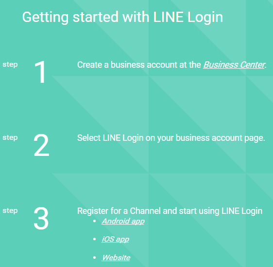

### *[注]需要先用手机下载Line,注册一个Line账号*

## Step.1
### 进入[Business Center](https://business.line.me/zh-hans/)
### 选择LINE Login
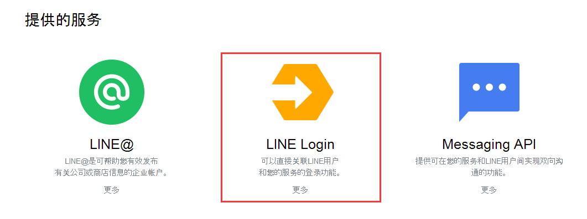
### 使用LINE账号登陆
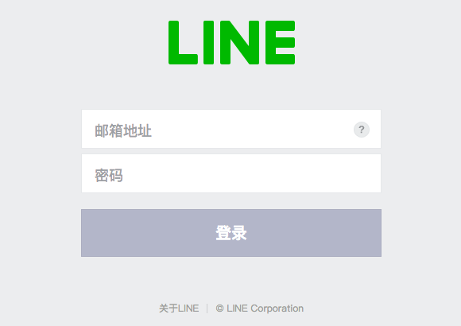

## Step.2
### 进入[android平台设置](https://developers.line.me/android/channel-registration)
### 创建账户并验证邮箱，点击邮件里的链接对帐户进行设置
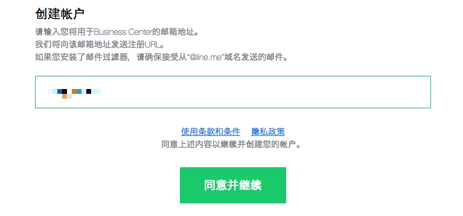
### 创建LINE登陆
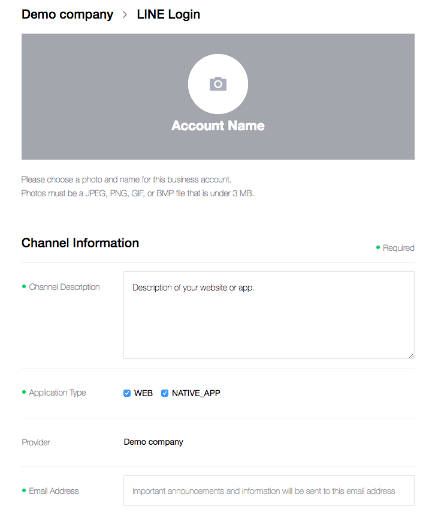

## Step.3
### 填写相关信息，Bundle ID
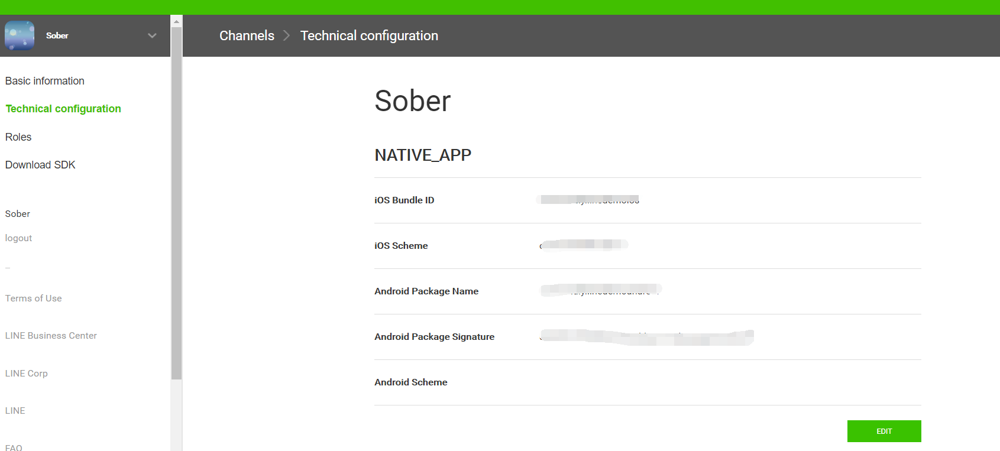

## Step.4
### 下载IOS平台LINE SDK导入工程

### Add “-ObjC” to Build Settings > Other Linker Flags
### Enable Keychain Sharing
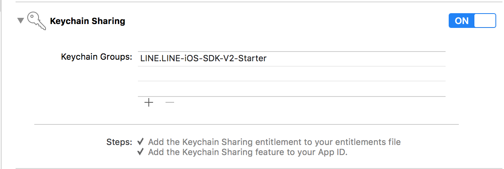
### 修改info.plist
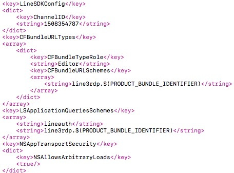

## Step.5
### 加入LINE登陆代码（详细见Demo及官方文档）
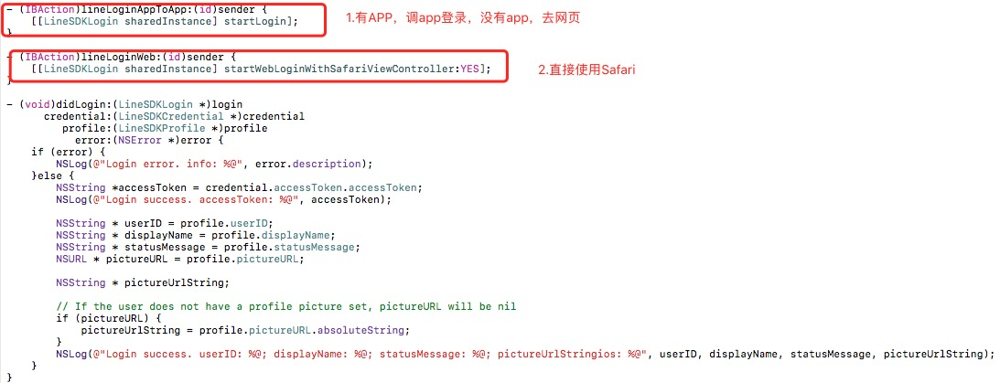

## Step.6
### LINE分享（详细见Demo）
### 需要在info.plist中加入以下代码：
·<key>LSApplicationQueriesSchemes</key>
<array>
<string>line</string>
</array>·
### 分享文字
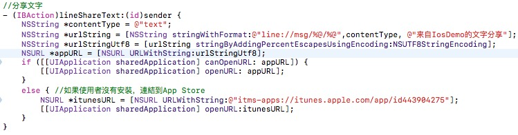
### 分享图片
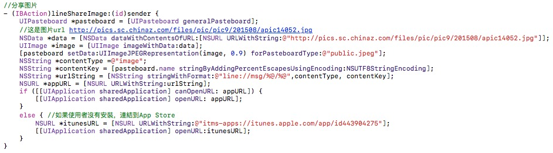
